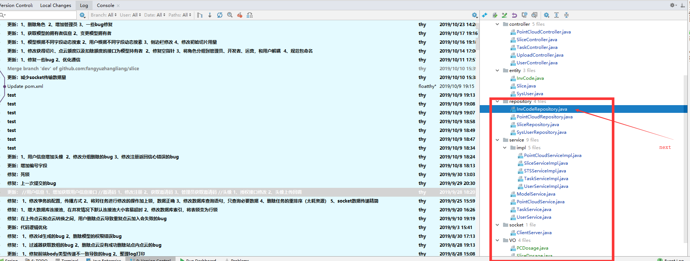
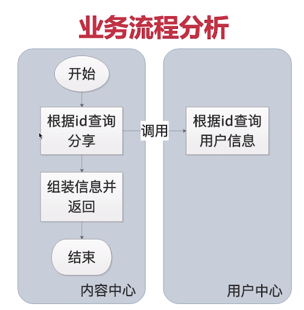
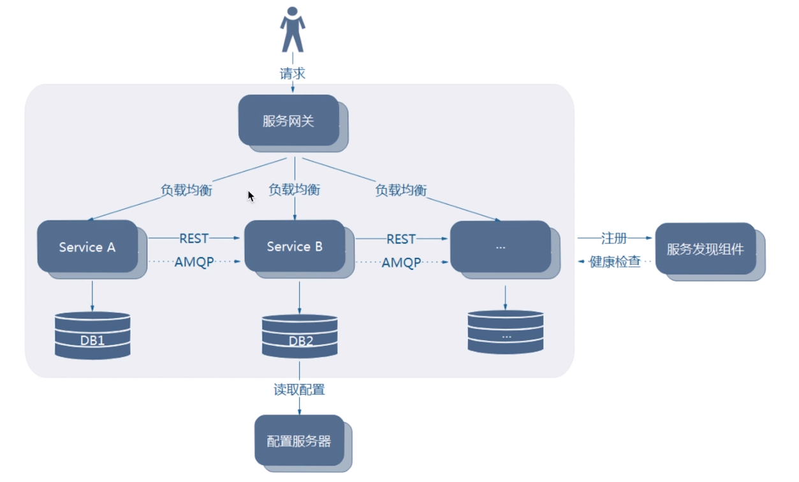

## akf拆分

  

三个维度拆分

删除没有限定是管理员

~~getUserInfo 接口删除~~

generateInvCodeForAdmin 没有限定管理员

recharge 充值没有限定管理员

dao

~~getUserWithOSSPathByModelUid 去掉模型~~

~~getPerm会出错，需要修改~~

reset 没有限定管理员

~~dsl删除用户点云数量~~

adminSearch  modelservice 没有限定为管理员

adminDelete 没有限定为管理员

adminAdd 没有限定为管理员

~~getUserInfo 被删除~~

## 数据库微服务改造

在老系统中存在很多跨表join查询，然而在微服务改造过程中，跨表变为了跨库，在跨库的情况下如何解决join查询的问题需要解决

### 1、冗余储存

在查询的被关联表冗余查询

以空间换时间

优点：查询效率较高

缺点：需要建立同步机制，不然容易产生脏数据

### 2、表同步

依赖字段很多做表同步

ETL工具跨库

缺点：同步不建议实时性过高，否则影响性能

### 3、数据字典表

在每个数据库中对静态不会修改的字段冗余保存一份

### 4、服务层数据组装

## Domain Driven Design

书单：

领域驱动设计

实现领域驱动

## 拆分

### 职责划分

### 通用性划分   

大中台小前台

### 粒度

满足业务需求

团队成员工作量适中

增量迭代  修改只涉及到有限的服务

风险可控

## 数据建模

mysqlWorkbench

实际开发流程：

 MySQL底层是通过数据页存储 

spring boot 可以读取jar包相同路径的配置文件

运维要求

